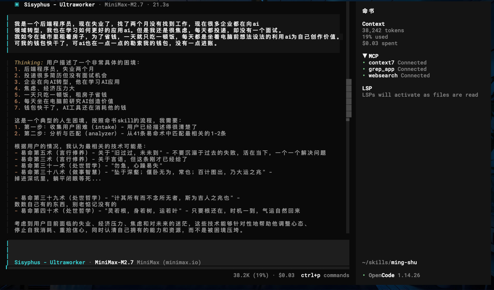
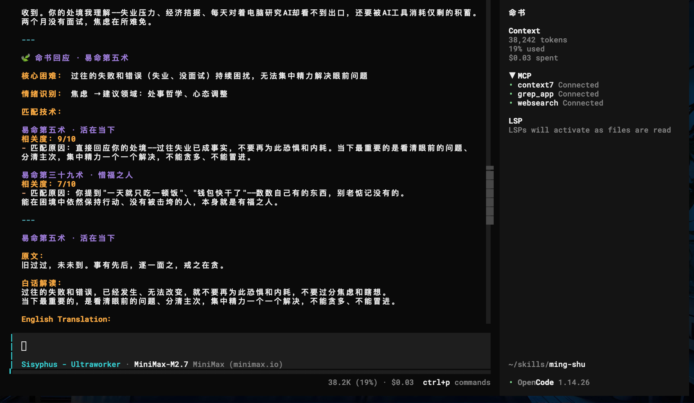
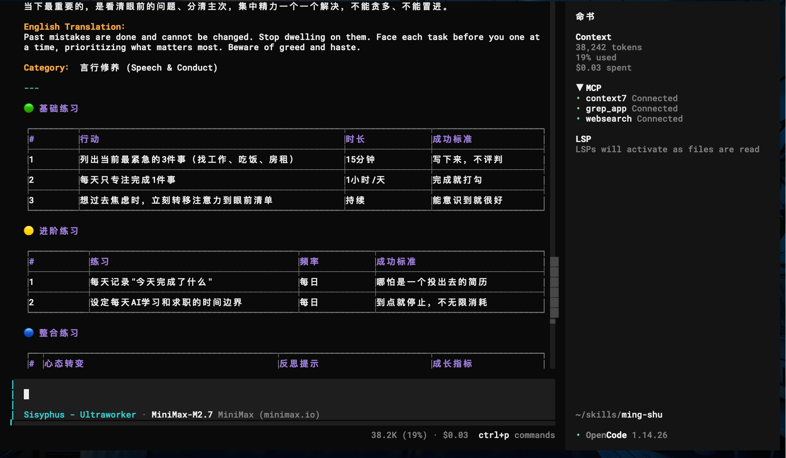
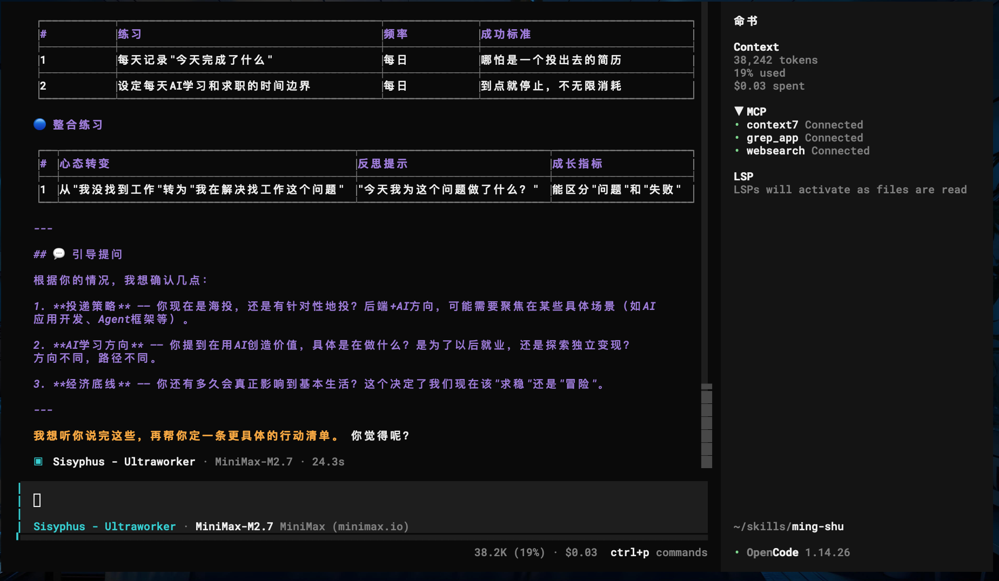

# 🧬 命书 (Ming Shu)

### 改运奇书智慧指引

[](https://opensource.org/licenses/MIT)
[](https://www.python.org/)
[](https://github.com/kruily/ming-shu)


**基于番茄《改运奇书》中的"命书"，助你应对人生困境**

---

## 人生总有迷茫时

你是否曾经历这些时刻？

工作多年，却觉得一直在原地踏步。想转行，又不知道方向在哪里。

人际关系让你疲惫。不知道谁值得信任，不知道该怎么说话才不出错。

财务压力像一座山。赚钱不容易，守住更难，投资更是像走钢丝。

夜深人静时，那些失败的经历一遍遍在脑中回放。越想越焦虑，越焦虑越睡不着。

**命书不是占卜，而是智慧。**
它不告诉你未来会怎样，它告诉你：在当前处境下，古人留下了什么智慧可以指引你。

---

## 🧭 核心理念

> 命书不是占卜，而是智慧。
> 它不告诉你未来会怎样，
> 它告诉你：在当前处境下，
> 古人留下了什么智慧可以指引你。

命书来自《改运奇书》小说。书中的命书并非神秘的预言，而是一套源自中国古典哲学的人生智慧。41条易命术，每一条都针对一种具体的人生处境。

**阅读原作：** https://fanqienovel.com/page/7573616392256097305

它讲的不是命运注定，而是人在不同处境下如何做出更好的选择。

---

## ✨ 功能特点

### 🎯 困境咨询

描述你的困难，获取针对性的命书智慧。不用抽签，不用占卜，只需要说出你的处境。

### 📜 每日一术

每天随机获得一条易命术，作为当天的行动指引。不是随机的鸡汤，而是有针对性的智慧。

### 🔖 验证书签

收藏那些对你有帮助的技术，日后可以随时回顾。你的个人智慧库。

### 🌐 双语支持

原文是古典中文，解读是现代白话，同时配有自然英文翻译。跨越语言，智慧相通。

### 💾 记忆系统

保存对话历史，命书记得你说过的话，在你需要的时候给出连贯的建议。

---

## 🚀 快速开始

### 最快方式

让你的 Agent 自动安装，只需要说：

```
请帮我安装命书 skill：https://github.com/kruily/ming-shu

安装完成后，输入 /ming-shu 或"每日一术"开始使用。
```

### 手动安装

```bash
git clone https://github.com/kruily/ming-shu ~/.claude/skills/ming-shu
```

### 安装到不同平台

| 平台        | 安装命令                              |
| ----------- | ------------------------------------- |
| Hermes      | `hermes skills add ming-shu`          |
| OpenClaw    | `npx clawhub@latest install ming-shu` |
| Claude Code | 克隆到 `~/.claude/skills/`            |
| Codex       | 克隆到 `~/.codex/skills/`             |

---

## 💬 命书对话示例

```
用户: 我最近失业了，很迷茫

命书: 收到。根据您的情况，推荐【易命第五术】

---

### 易命第五术 · 活在当下

**原文：**
旧过过，未未到。事有先后，逐一面之，戒之在贪。

**白话解读：**
过往的失败和错误，已经发生、无法改变，就不要再为此恐惧和内耗，不要过分焦虑和瞎想。当下最重要的，是看清眼前的问题、分清主次，集中精力一个一个解决，不能贪多、不能冒进。

**English Translation：**
Past mistakes are done and cannot be changed. Stop dwelling on them. Face each task before you one at a time, prioritizing what matters most. Beware of greed and haste.

---

**行动建议：**
| # | 行动 | 时长 | 成功标准 |
|---|------|------|----------|
| 1 | 写出当前最紧急的3件事 | 15分钟 | 列清单，不评判 |
| 2 | 每天只专注完成1件事 | 1小时/天 | 完成就打勾 |
| 3 | 想过去时，立刻转移注意力 | 持续 | 能意识到就很好 |

---
需要我进一步解读这一术吗？
```

---

## 📚 41条易命术总览

命书涵盖了人生的各种处境：

| 领域       | 技术编号                                       | 核心主题                           |
| ---------- | ---------------------------------------------- | ---------------------------------- |
| 环境与健康 | 第1-2术                                        | 整洁使人身处有序，节奏使人心神安定 |
| 言行修养   | 第3、5、12术                                   | 言语的力量、专注做事、诚意正心     |
| 财富之道   | 第4、25-27、32-34术                            | 见利求财、勿贪、慎投资、善用财     |
| 人际之道   | 第9、19、22、30术                              | 识人、交朋友、夫妻相处、用度之道   |
| 做事智慧   | 第6、15-18、38、41术                           | 顺势而为、判事成败、合作忘私       |
| 处世哲学   | 第7-8、10-11、13-14、20-24、28-29、31、35-40术 | 不贪、知足、自知、淡定             |

---

## 📸 截图展示 | Screenshots

<!-- 截图将在这里添加 -->






<!--  -->

---

## 📁 项目结构

```
ming-shu/
├── SKILL.md                    # 技能入口
├── README.md                   # 本文件
├── origin.md                   # 命书原文出处
├── references/
│   ├── mingshu-zh.md          # 中文命书（41术完整收录）
│   └── mingshu-en.md          # English translation
├── prompts/
│   ├── intake.md              # 收集用户困难
│   ├── analyzer.md            # 分析匹配技术
│   ├── interpreter.md         # 原典解读
│   ├── action_generator.md    # 行动清单生成
│   └── guidance.md            # 引导提问
└── tools/
    └── memory_manager.py      # 用户记忆管理
```

---

## ⚠️ 免责声明

本技能内容基于《改运奇书》小说中的命书，仅供娱乐参考。

命书是智慧，不是专业建议。遇到健康、法律、财务等实际问题，请咨询相关领域的专业人士。

---

## 📄 License

MIT License - 欢迎使用、修改、分发。

---

_命书之道，在于自知；自知之明，在于践行。_
